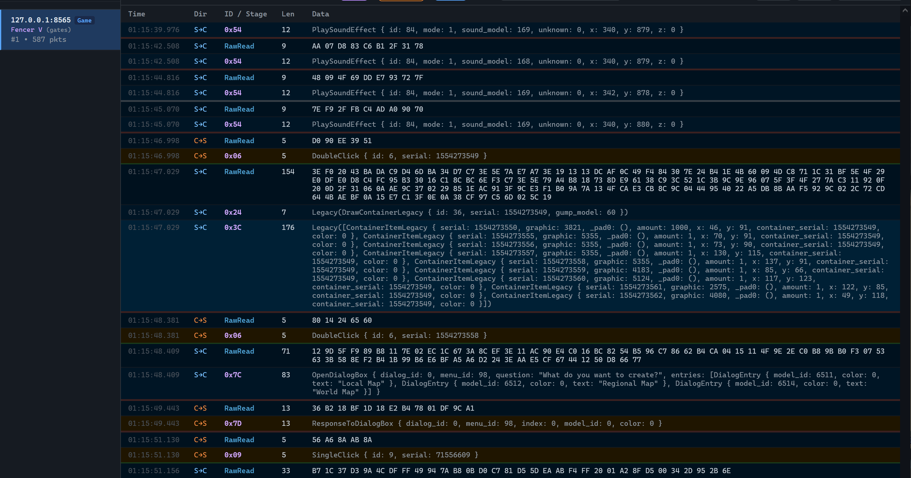

# ungine7

`ungine7` is an experimental Rust workspace for studying Ultima Online
network protocols, packet formats, client data files, and game-world systems.
It contains reusable libraries together with small server, client, proxy, and
data-inspection examples.

## Highlights

Beyond the libraries, this workspace ships full working tools built on top of
them:

- **MITM proxy with a live web packet inspector** — every session, every
  packet, parsed into typed structures in real time.
- **Session recording & replay** — record a play session to a compact log and
  replay it later, including in-game scrub controls (pause / step / seek)
  rendered as a gump inside the real UO client.
- **A pathfinding + line-of-sight microservice** that can mirror the live
  world of any real server it's pointed at, and expose it over HTTP/WebSocket.
- **Runtime-switchable Lua scripting** (in the `demo-server` example) — async
  worker scripts, coroutine-based entity controllers, and per-session
  scripts, all hot-reloadable, with the session mode chosen per connection
  at runtime. See [`examples/demo-server/README.md`](examples/demo-server/README.md).



See [`examples/README.md`](examples/README.md) for the full list, more
screenshots, and how to run each one.

## Building

Requires a recent stable Rust toolchain with **edition 2024** support
(Rust 1.85+), and a C compiler toolchain on the build machine (needed to
build the vendored Lua runtime used by `demo-server`'s `lua` feature).

```powershell
# Build every crate and example in the workspace
cargo build --workspace

# Release profile (recommended for the proxies/servers)
cargo build --workspace --release

# Build/run just one example
cargo run -p web-proxy --release -- --help
```

Some examples gate extra functionality behind Cargo features that are on by
default (e.g. `demo-server`'s `lua` and `mirror` features) — see each
example's own docs for details.

## Workspace crates

| Crate | Description |
| --- | --- |
| [`u-core`](u-core) | Shared protocol types, positions, versions, and packet direction. |
| [`u-io`](u-io) | Binary readers, writers, encoding traits, and packet I/O helpers. |
| [`macros`](macros) | Procedural macros for packet and Lua-related code generation. |
| [`packets`](packets) | Ultima Online packet definitions and serialization. |
| [`protocol`](protocol) | Protocol detection, packet framing, encryption, and transport support. See its [API notes](protocol/API.md). Exercised by every proxy and server example below. |
| [`network`](network) | Higher-level login and game-network client support. See its [API notes](network/API.md). Exercised by every proxy and server example below. |
| [`files`](files) | Parsers for selected Ultima Online client-data file formats. |
| [`framework`](framework) | World observation, movement validation, entities, and server-side systems. See its [API notes](framework/API.md). Functionally rich but organically grown — see the examples for concrete, working usage patterns. |

The [`examples`](examples) directory contains executable demonstrations and is
not intended as production-ready software.

## Educational Use Only

This project is provided solely for educational and research purposes. It is
intended to help study network programming, binary protocols, file formats,
and game-world implementation techniques.

The maintainers do not endorse or support real-world deployment, operation
against live services, unauthorized access, automation, or use that violates a
service's rules or applicable law. Do not use this project to bypass security,
interfere with services, or access systems or data without authorization.

Ultima Online and related names are trademarks of their respective owners. This
project is not affiliated with or endorsed by those owners. It contains code
only; users are responsible for obtaining and using any client data lawfully
and must not redistribute proprietary game assets through this repository.
