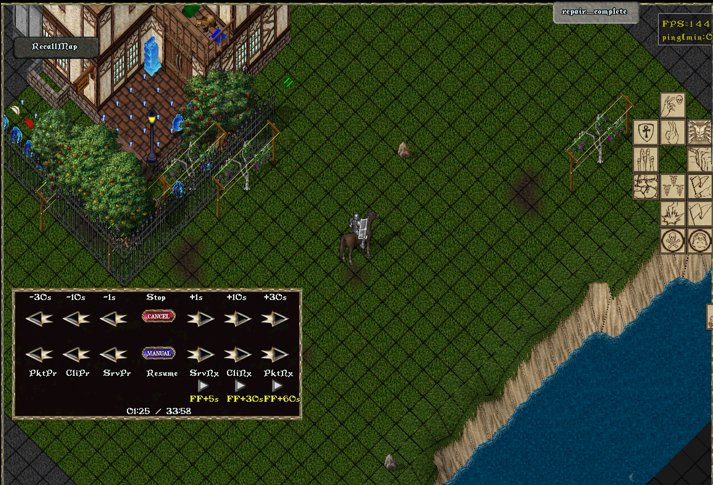
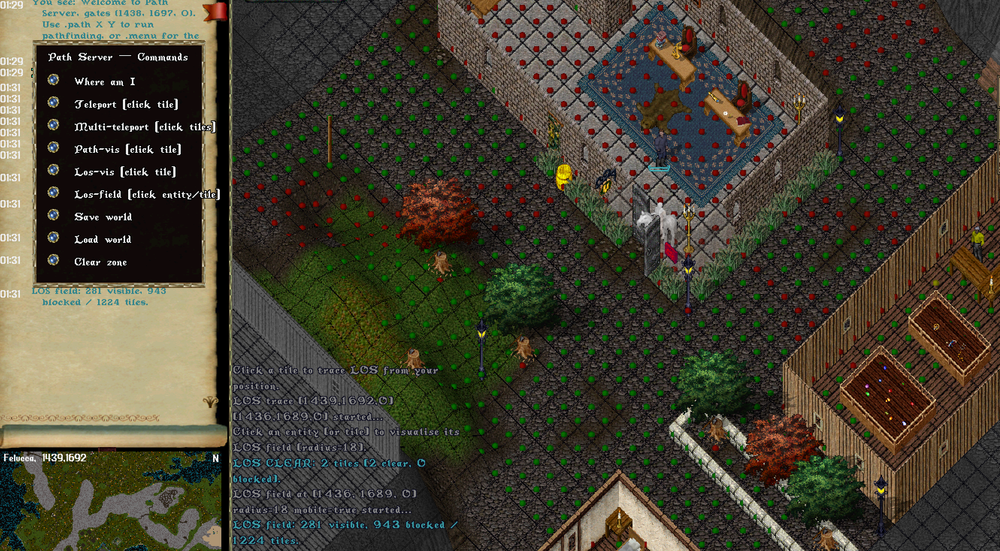

# Examples

This directory contains executable demonstrations built on the workspace
crates: protocol handling, local game-server behavior, proxies, recording and
replay, and client-data inspection.

Run an example from the repository root with:

```powershell
cargo run -p <package-name> -- [arguments]
```

## Flagship examples

These are the most complete, practically usable tools in the repository.

### web-proxy — MITM proxy with a live web packet inspector

Package: `web-proxy`

A full man-in-the-middle proxy for a UO client/server pair, with a
browser-based UI that shows every session and every packet — parsed into
typed structures — as it happens. Multiple proxy instances, SOCKS5 upstream,
raw byte logging, all manageable through a REST API + web UI.


### replay-proxy — record and replay full game sessions

Package: `replay-proxy`

Records live sessions to a `.uolog` file and plays them back later — either
as ordinary server-list entries (works fully offline, no real server needed)
or recorded transparently while relaying to a real server. Playback exposes
VCR-style controls (pause, step-by-packet/client/server, seek ±1s/10s/30s) as
an in-game gump, driven from inside the real UO client.



### path-server + mirror-proxy — pathfinding & line-of-sight service with world mirroring

Packages: `path-server`, `mirror-proxy`

`path-server` is a specialized server exposing pathfinding and line-of-sight
queries over HTTP/WebSocket (plus a small UO-protocol server of its own).
`mirror-proxy` sits in front of any real UO server and streams every
server-to-client packet into `path-server`'s `/ws/mirror` endpoint — so
path-server's world model mirrors the live world of the real server it is
watching, letting you run pathfinding/LOS queries against real, up-to-date
map state.



## Automation & work-in-progress

- **[`rpc-proxy`](rpc-proxy)** (package: `rpc-proxy`) — a proxy controllable
  over RPC/WebSocket, with a Lua scripting layer and a virtual-client session
  model. A solid work-in-progress scaffold for building a scripted automation
  client; not feature-complete.
- **[`text-client`](text-client)** (package: `text-client`) — an interactive
  terminal (TUI) client: login screen, ASCII world rendering, movement, chat,
  dot-commands. Functional but unfinished; a good starting point for a
  minimal custom client.

## Advanced reference

### demo-server — the biggest example, exercising nearly everything

Package: `demo-server`

By far the largest example in the workspace — a local UO server touching
almost every framework capability, plus a distinctive three-layer Lua
scripting subsystem (async worker scripts, coroutine-based entity
controllers, and per-session scripts) with hot-reload and a session mode
switchable **at runtime** per connection. It is also, explicitly, the least
finished example — skills don't train, ships don't sail yet, and several
systems are intentionally minimal placeholders.

See [`demo-server/README.md`](demo-server/README.md) for the full feature
list, the scripting subsystem, and known limitations.

## Servers & Clients (tests / references)

| Example | Package | Purpose |
| --- | --- | --- |
| [`client`](client) | `client-example` | Minimal protocol client. |
| [`server`](server) | `server` | Minimal server using the protocol crate directly. |
| [`simple-server`](simple-server) | `simple-server` | Minimal server using the network crate. |

## Proxies (tests / references)

| Example | Package | Purpose |
| --- | --- | --- |
| [`proxy`](proxy) | `proxy-example` | Basic protocol proxy. |
| [`simple-proxy`](simple-proxy) | `simple-proxy` | Simplified proxy using the network crate. |
| [`memory-proxy`](memory-proxy) | `memory-proxy` | In-memory proxy experiment. |

## Utilities

| Example | Package | Purpose |
| --- | --- | --- |
| [`data-files`](data-files) | `data-files` | Inspect supported client-data file formats. |
| [`benchmark`](benchmark) | `benchmark` | Local server, client, and movement benchmarks. |
| [`common`](common) | `common` | Shared support crate used by several examples. |

## Educational Use Only

These examples are solely for education and research. Run them only against
systems and data you own or are explicitly authorized to use. Do not expose
them to public networks, use real account credentials, automate third-party
services, bypass security controls, or violate a service's rules or applicable
law.

The examples may handle legacy plaintext authentication and are intentionally
minimal. Do not treat them as a secure deployment template.
